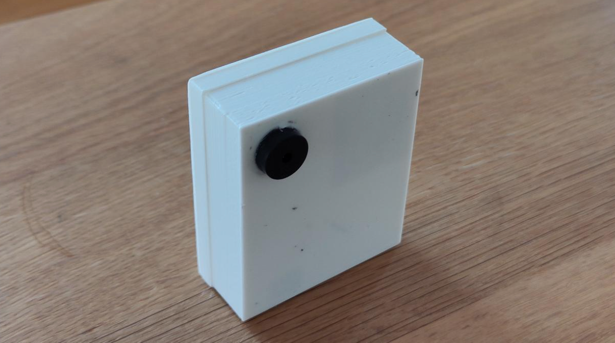

# Nerd Neck - A wearable health device

## Context

This is the report for the nerd neck device. An embedded project for the lecture _Computer Architecture_ at the
University Basel for
the semester 2024.

Date: 20.01.2025

Student: Yasin Gündüz

# Abstract

In today's office work people are sitting too much, which results in several health issues, like back pain
or chronicle bad postures. One of these is called "nerd neck", where the head protrudes forward from the shoulders.
This project is an effort to help people maintain a good posture while sitting
or standing, to decrease health issues originated by bad posture habits.

The nerd neck device is a 3d-printed wearable device where the device is
attached to a persons back and tracks the back's orientation in regards the gravity's axis.
Using an ESP32 and programmed in Rust, an inertial measurement unit together with a sensor fusion filter is
efficiently detecting the person's posture. When a bad posture is detected, a buzzer will notify the person to correct
the posture.

# Introduction

Office workers, or programmers at work, tend to have a bad posture in front of their laptops, or working at
desks. When exposed too long to a bad posture, this can result in several health issues. Back pain is just one example
of this.
There are already countermeasures to fight bad postures. For example ergonomic trainings for office
workers are carried out, to make working in office jobs healthier.

The approach this project is following is a bit different. Instead of proactive trainings,
the outcome of this project should react to bad posture of a person and a user
should be notified when having a posture.

As this project should be wearable, it means the device must be battery powered. Also, as a person
is wearing this device, the form factor of the device should not be big, so it is for example
attachable to a person's back.

The project is already restricted to be as small as possible and battery powered. Being battery powered,
it also means it is not allowed to draw much current to remain as long as possible active.

Moreover, it must track the posture of a person to be able to react to a bad posture.
And finally, the person must also be notified when being in a bad posture.

In the following section, I will describe how I solved above goals.

# Methodology

## Outline

The 3d printed device is polling the current orientation from the inertial measurement unit (IMU) every 50 milliseconds.
As the IMU angular velocities are error-prone in general, a sensor fusion algorithm is used,
i.e. the Madgwick filter (a sensor fusion filter), to integrate the angular velocity over time and have an error correction to it.

If the orientation surpasses a configurable threshold, an active buzzer is activated, that is powered
directly with a 1kHz Pulse Modulo Width (PWM) signal, generating the notification sound.

## Hardware

### Components and Wiring

To be as small as possible, the esp32s3 from seeed xiao, a microcontroller unit (MCU), is used.
It comes with a small form factor and can be directly
soldered to a Lithium-Polymer (LiPo) battery for which it has an integrated circuit to load the battery.
This already solves the battery-driven goal of this project.

To measure the person's bad posture, it is enough to measure the orientation of a person's back. Therefore,
we use an inertial measurement unit (IMU), that gives us the orientation information with its gyroscope values.
The IMU is connected via an inter-integrated-circuit (I2C), a common serial communication protocol,
to communicate with the MCU.

When reaching a certain orientation (i.e. a bad posture), an active buzzer is attached to one of the
general purpose output/input pin of the MCU.

Below, you can see the wiring of the breadboard version of the device (Note: The images of the components
are incorrect—the wiring is correct). The I2C is connected to the GPIO pins
5 and 6. To make the I2C work, it is necessary to have pull-up resistors,
that pull the signal to the MCU's high logical voltrage (3.3 volts). The IMU itself can only pull the signal down.
This is what I had to learn during several hours of debugging. Common I2C resistor values of 4.7k Ohms are used.

The resistor for the buzzer is to protect the MCU's GPIO from overdrawing current of the buzzer. There a 100 Ohms
resistor is used.

For a complete list of all the components, have a look at the reference section.

### 3d Printed Casing

As the device should be wearable, all the components from above need to be housed.
Therefore, a 3d printed casing was designed. It consists of a bottom shell and
top shell, that can be connected to one another, to close the housing.

As the LiPo battery is quite flat, the battery is housed in the bottom part, whereas the
top shell is housing the MCU, the buzzer as well as the IMU.

There were a lot of problems with the initial designs (you can see them at
the [nerd-neck project](https://github.com/yguenduez/nerd-neck)).
First, it was tried
to create a design that allows the bottom shell to be snapped in the top shell of the housing to close
it.

However, the small snapping elements always broke, because they had to be
In a second iteration it was tried to make the housing slideable. Meaning, we can slide the bottom (battery part) into
the top shell. With this design, the housing was just too big, compared to the inner volume the components are housed in.

In the end, after already five design iterations, a small tip from a colleague helped. He mentioned that I should
use a so-called "pressfit" version. This means the two parts do not fit perfectly into one another, so you have to press
them into each other. The friction alone keeps both parts together. As an immediate consequence, the housing got much
simpler to design—and also to use.

You can see both shells in the pictures below, without and with the components in it.

  
  

# Software

The firmware for the esp32s3 is written with Rust. [Espressif](https://www.espressif.com/), the creators of the esp32
family created a lot of tooling it in Rust
for their chips. With one line of a command, you can build and flash the firmware directly onto the esp32 from any host
system (in this case MacOS or Windows 11) via usb-c. This project makes also use of the
[esp_hal](https://github.com/esp-rs/esp-hal). A hardware abstraction layer for the esp32 family.

The only downside to Rust in the embedded world has been, that it is quite new. Tutorials and HowTos
were already outdated, when reading them. Generally you have to stick to the latest documentation,
that comes with a library you use.
Even trying to use ChatGPT for programming rendered useless, as the recommended APIs were already outdated. And most
of the APIs had breaking changes in them.

## Architecture

In software, the tracking of a person's pose and the notification of a bad posture is separated. Therefore,
there are two asynchronous running tasks, namely the IMU polling task and the notification task, which you can see in
see in the below flowchart diagram.

The IMU polling task polls the angular velocities,
as well as the acceleration data from the IMU every 50 milliseconds.
Directly after, both vectors are given to the Madgwick Filter adapter, to correct the errors of the IMU
data.

From our filter we receive a quaternion, which describes the current orientation of our device.
At the end of the loop cycle of the IMU polling task, we check if the device's orientation to the z-Axis (direction of
gravity) surpasses a threshold.
Namely, if the angle between the device and the gravity's direction
is greater than 22.5 degrees, we send a signal to the notification task, to wake it up.

The notification task is sleeping and is awakened by the polling task. When the notification task is awakened
we generate a PWM signal of 1kHZ for 2 seconds and put the notification task back to sleep to save power.

When the PWM signal is on, an active buzzer generates sound.
We manually generate the PWM signal
by setting a General Purpose Input/Output (GPIO) pin to high, wait 500 microseconds and set the GPIO pin
to low again. While the Buzzer is active (pwm is on) any further signals from the first task are ignored.

It is important to note that the asynchronous rust framework [embassy](https://embassy.dev/) for embedded
systems allows the tasks to be asynchronous. On high level, it acts as a scheduler for our embedded device, putting
tasks to sleep, and waking them up, when needed. With it, we do not have so-called "busy polls", but rather
software interrupts, which make our device much more efficient in terms of energy usage.
Even the IMU poll task wakes up every 50 milliseconds, does its job, and then goes back to sleep.

## Sensor Fusion

### Choosing a Filter

IMU angular velocities cannot just be integrated over time, as those values
are affected with errors. If you integrate those values, one will receive
a so called IMU-Drift, where the error biases are also integrated over time.

To solve this issue, there are already several filters at hand, that could be
used for the project:
- Kalman Filter
- Mahony Filter
- Complementary Filter
- etc.

It has been a spoilt for choice. The filter, usually used for an embedded device, which was the Madgwick Filter,
was chosen. Additionally, there has been an open-source library with its implementation at hand ([ahrs-rs](https://github.com/jmagnuson/ahrs-rs)).

### Madgwick Filter

The Madgwick filter ([paper](https://x-io.co.uk/downloads/madgwick_internal_report.pdf)) is a sensor fusion algorithm
by [Sebastian Madgwick](https://ahrs.readthedocs.io/en/latest/filters/madgwick.html),
that is suited well for embedded devices due to its efficiency.

It integrates the angular velocities, by integration of the quaternion derivatives over time.
As integration of angular velocities from an IMU is prone to drift, the madgwick filter uses
the earth's gravity field as a reference direction to compensate for that IMU
drift
([source here](https://ahrs.readthedocs.io/en/latest/filters/madgwick.html#orientation-as-solution-of-gradient-descent)).

Therefore, the Madgwick filter has one parameter you need to adjust.
It is called the filter gain beta, and there exist
some recommendations on which value to choose from.

When picking the right value for beta, there is a trade-off between the stability
of the resulting orientation and its response. For example for drones (values up to 0.3), which
have to react fast, the Madgwick Filter is optimised for high responsiveness.
On almost static, or human motion tracking (values 0.01–0.1) the filter is optimised for stable output.

A value of 0.1 is used (This is the recommended default value for a general purpose application),
as it showed the best trade-off between responsiveness and stability for the application.

# Closing

Doing this project was really rewarding. On the one hand, you could integrate
already known concepts from software engineering. On the other hand you could integrate
knowledge from hobby projects like 3d printing.
You could even learn something completely new, which was Rust on the embedded side and
soldering for me.

In the end I created a battery-driven, wearable device, that can track a posture
and notify that person, if that posture should be corrected - and therefore can help
people fostering a healthier lifestyle.

Below the image of the assembled device

But of course, there can be several points, that can be improved, which I describe in the following section.

## Improvements

The first thing, that can be improved, is the battery management. The MCU can load the battery,
but there is no information about the current charge of the battery. This is potentially dangerous,
as the LiPo could be drawn empty.

Also, being relatively new at soldering, the cable management could be improved a lot. Looking at it
makes me sad. Maybe adapter solutions could be used instead of soldering so much connections.

In the below list, more improvements are added:
- Using an MCU with an integrated IMU: For example
  the [Seeed xiao nRF sense](https://www.seeedstudio.com/Seeed-XIAO-BLE-Sense-nRF52840-p-5253.html) comes with an
  integrated IMU. With this the I2c connection could be made obsolete.
- Smaller LiPo Battery: The battery is quite oversized for such a small project. A smaller battery could be used, making
  the device
  even smaller
- All the MCUs support Bluetooth. Or even Bluetooth Low Energy. One could connect the device via bluetooth to a
  smartphone.

# References

The project itself is open-sourced at [https://github.com/yguenduez/nerd-neck](https://github.com/yguenduez/nerd-neck).
The code, stl files for printing and more documentation (on e.g. how to build and flash it), can be found there.

## Content

- [Madgwick Paper](https://courses.cs.washington.edu/courses/cse466/14au/labs/l4/madgwick_internal_report.pdf)
- [Sharing Data amognst asynchronous tasks in embassy](https://dev.to/theembeddedrustacean/sharing-data-among-tasks-in-rust-embassy-synchronization-primitives-59hk)

## Use of open-source libraries and frameworks

The [esp_hal](https://github.com/esp-rs/esp-hal), an esp hardware abstraction layer for Rust. With it you can
access the ESP GPIO pins, or create other interfaces like i2c in an easy and convenient way.

Also, [embassy](https://embassy.dev/) is used, an asynchronous runtime for embedded systems, that makes it easy
to create asynchronous tasks and to communicate between those.

For the inertial measurement unit (IMU), a library called [bmi160-rs](https://github.com/eldruin/bmi160-rs) is used and
I created a small adapter around the library's API to our needs.

As a library for the Madgwick filter, I used [ahrs-rs](https://github.com/jmagnuson/ahrs-rs), which is a rust implementation. An adapter around the library API is created to fit our needs.

Furthermore, [nalgebra](https://github.com/dimforge/nalgebra) is used to work with quaternions, calculating angles.

## Bill of Materials

The device consists of:

- a small microcontroller unit (MCU), an esp32s3 from xiao seeed, which has a small form
  factor. [Link](https://www.bastelgarage.ch/seeed-studio-xiao-esp32-s3-1-2809?search=esp32s3%20xiao%20seeed).
- an inertial measurement unit (IMU), that can measure acceleration and the angular velocity with a
  gyroscope. [Link](https://www.bastelgarage.ch/gravity-i2c-bmi160-6-axis-motion-sensor-with-gyroscope?search=bmi160)
- a small lithium polymer (LiPo) battery, to power the wearable
  device. [Link](https://www.bastelgarage.ch/solar-lipo-1-105/lipo-battery-1500mah-jst-2-0-lithium-ion-polymer).
- a small beeper/buzzer to notify the person about a bad
  posture. [Link](https://www.bastelgarage.ch/piezo-buzzer-summer-active?search=active%20buzzer)
- 2x 4.7k Ohm Resistors for the i2c connection.
- 1x 100 Ohm Resistor for the GPIO pin 7 for overdrawing protection
- Wires to connect the components by soldering
- JST-PH crimp plugs and sockets (To not directly solder the battery to the
  MCU), [link](https://www.bastelgarage.ch/jst-ph-crimp-stecker-und-buchsen-2mm-set-40-stuck)

which are all contained in a 3d printed housing.