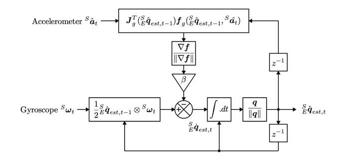
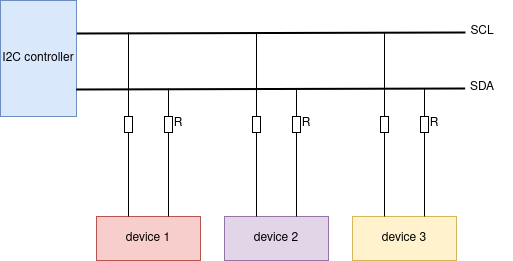
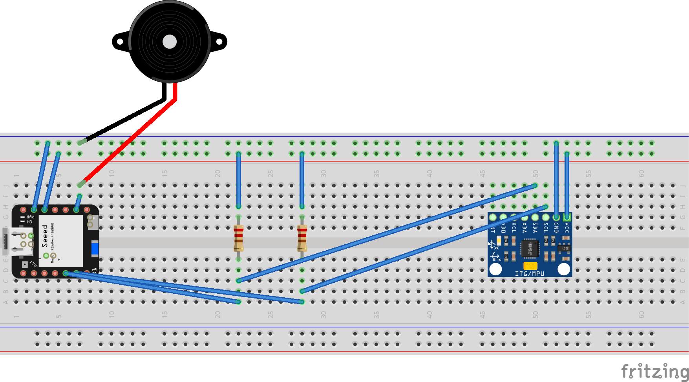
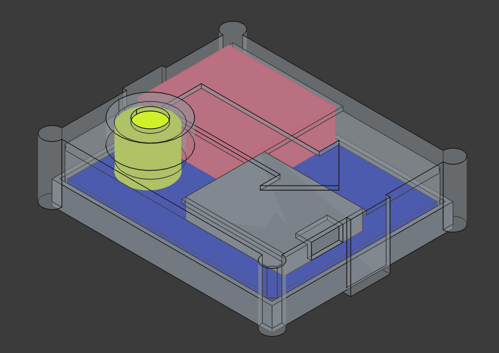
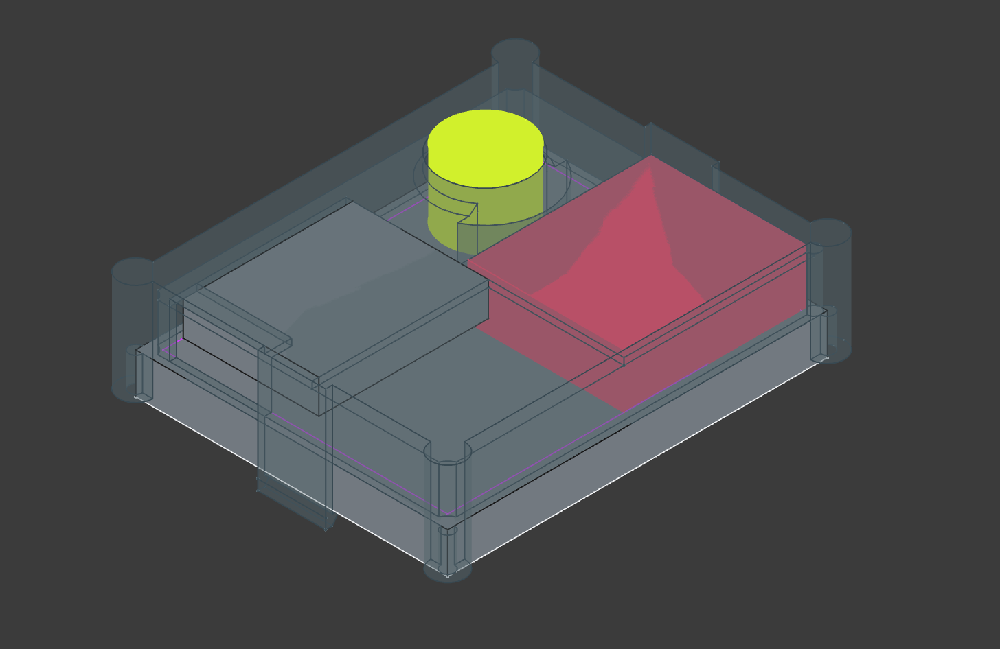
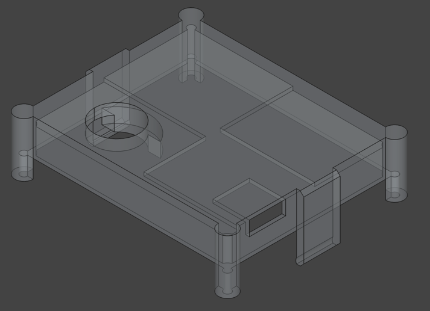

# Nerd Neck on ESP32-S3

This small device will detect bad posture, if the person wearing this device has it attached to the back.

## Outline 

We read IMU data in a cycle. Every x milliseconds we receive IMU data.
As the IMU values drift, we need a filter(s): Those correct the drift integrated over time with sensor fusion
algorithms.

If the orientation of the device passes a certain threshold,
the device will start beeping for y, notifying the person to rectify its position.
It will remain beeping, until the person corrected its position.

The whole device is a wearable, so it needs a battery (LiPo) and a 3d printed casing.

## TODOs

- [x] Calculate an angle to Z-Axis (with Filters), that can be used as "beep" input
- [x] ~~Do a calibration for the Gyro before starting (if not moving, gyro values should be 0).~~ (Filter already corrects offsets)
- [x] Write a little rust driver for the speaker, that controls it
- [x] On a configurable threshold - enable the trigger for the beep speaker
- [ ] Apply a LiPo (3.7 Volts) battery adapter to the battery pins
- [x] Design 3d model for the casing to print
- [x] Print the casing
- [ ] Assemble the parts
- [ ] Test different parameters (Hz ratio, Beta value etc.), and document outcome
- [ ] Write Report with Markdown
- [ ] Slides with UniBas flavour

## IMU Drift

Gyroscope does drift, when integrated over time, so we need to correct those values with sensor fusion algorithms,
with other sensor values. Both IMUs we can use, also come with an accelerometer.
So we combine smooth short-them gyroscope data with long-term stability of accelerometer data.

Possible Filters:

- **Complementary filter** (simpler but effective for many use cases).
- **Madgwick filter** (a fast, quaternion-based algorithm for IMUs).
- **Mahony filter** (similar to Madgwick with some differences in accuracy and computation).
- **Kalman filter** (complex but precise, especially for combining multiple sensors).

**Note**: As we are only interested in the tilt of the IMU (diff angle to the vertical z-axis), we can neglect
the yaw angle (which would be corrected be the magnetometer, which we do not have).

So we can use either Madgwick or Mahony with only given accelerometer and gyro values.

### IMU Filter Implementation

There is already a [third party crate (ahrs-rs)](https://github.com/jmagnuson/ahrs-rs), that already implements both
Madgwick and Mahony filters
for both 6DoF and 9DoF IMUs.

A choice to be done is the filter gains, KI and KP for Mahony and Beta for Madgwick.

Some recommended beta values for the Madgwick Filter, where you have to choose
between responsiveness and stability:

| Drones/RC vehicles    | 0.1 - 0.3    | High dynamics, prioritize responsiveness.            |
|-----------------------|--------------|------------------------------------------------------|
| Robotics (general)    | 0.05 - 0.2   | Moderate dynamics, balance response and drift.       |
| Slow-motion systems   | 0.01 - 0.05  | Low dynamics, prioritize stability/noise rejection.  |
| Human motion tracking | 0.01 - 0.1   | Prioritize stability but allow small dynamic motion. |
| Static applications   | 0.001 - 0.01 | Low dynamics, focus on maximum stability.            |

TL;DR: We use the Madgwick filter with beta between 0.01 and 0.1. Currently, we use 0.1.
The paper for madgwick is [here](https://x-io.co.uk/downloads/madgwick_internal_report.pdf).

The Madgwick Feedback loop (from paper above):

## IMU Sensors

We have several IMU Sensors

- [BMI160](https://www.dfrobot.com/product-1716.html)
- [MPU6050](https://learn.adafruit.com/mpu6050-6-dof-accelerometer-and-gyro/arduino)

Both can be addressed via a I2C-Bus.

## Software for the MPU6050

There is already a [MPU6050 crate](https://docs.rs/mpu6050/0.1.6/mpu6050/). It's usable with i2c.

## Software for the BMI160

There is already a [BMI160 create](https://docs.rs/bmi160/1.1.0/bmi160/). Also usable with i2c.

## I2C interface

This bus comes with a dataline (sda) and a line for the clock signal (scl).

You can connect several devices to the bus, like shown below.

Note from [espressif](https://docs.espressif.com/projects/esp-idf/en/v5.3.2/esp32s3/api-reference/peripherals/i2c.html):

> The frequency of SCL is influenced by both the pull-up resistor and the wire capacitance. Therefore, users are
> strongly recommended to choose appropriate pull-up resistors to make the frequency accurate. The recommended value for
> pull-up resistors usually ranges from 1K Ohms to 10K Ohms.
> Keep in mind that the higher the frequency, the smaller the pull-up resistor should be (but not less than 1 KOhms).
> Indeed, large resistors will decline the current, which will increase the clock switching time and reduce the
> frequency.
> We usually recommend a range of 2 KOhms to 5 KOhms, but users may also need to make some adjustments depending on
> their
> current draw requirements.

**TL;DR**: Use 2-10kOhm resistors as pull up resistors.
The higher the frequency, the lower the ohmage should be.

We use 4.7k Ohms as pull-up resistors.

## Pinouts of esp32s3 from Seeed

## Current Wiring

We have an i2c setup, where two 4.7k Ohm resistors are used as
pull up resistors. If scl/sda are off, both signals are pulled up
up to the logical 3.3 Volts (high). The IMU (on the right)
will pull the signal down if needed.

Everything runs on the 3.3-volt level of the MCU.

The piezo speaker is directly connected to GPIO pin 7. It drains 15mA and is running 
with powered with a 1khz pwm signal, when triggered.

Below fritzing image is demonstrating the wiring. The parts are aliases though, we use different ones
but the wiring is exactly the same.

## Bill of Materials

Below all used Materials

### For the Breadboard Version

- MCU: Seeed xiao esp32s3, [link](https://wiki.seeedstudio.com/xiao_esp32s3_getting_started/)
- IMU: DF Robot BMI160 (6 DoF-IMU), [link](https://www.dfrobot.com/product-1716.html)
- 2x 4.7k Ohm Resistors as pull up resistors for the I2C connection
- Breadboard
- Active Piezo Buzzer, [link](https://www.bastelgarage.ch/piezo-buzzer-summer-aktiv?search=Piezo%20Buzzer%20Summer%20aktiv) 
- Wires

### The Assembled (Battery powered Version)

- MCU: Seeed xiao esp32s3, [link](https://wiki.seeedstudio.com/xiao_esp32s3_getting_started/)
- IMU: DF Robot BMI160 (6 DoF-IMU), [link](https://www.dfrobot.com/product-1716.html)
- 2x 4.7k Ohm Resistors as pull up resistors for the I2C connection
- Active Piezo Buzzer, [link](https://www.bastelgarage.ch/piezo-buzzer-summer-aktiv?search=Piezo%20Buzzer%20Summer%20aktiv)
- Wires
- Battery: LiPo, 3.7 volts with 1500mAh: [link](https://www.bastelgarage.ch/lipo-akku-1500mah-jst-2-0-lithium-ion-polymer?search=LiPo%20Akku%201500mAh%20JST%202.0%20%2F%20Lithium%20Ion%20Polymer)
- JST-PH crimp plugs and sockets (To not directly solder the battery to the MCU), [link](https://www.bastelgarage.ch/jst-ph-crimp-stecker-und-buchsen-2mm-set-40-stuck)

## Building and flashing

### Prerequisites

Install all the depenendencies:

- Install [Rust](https://www.rust-lang.org/tools/install)
- Install esp tooling
    - `cargo install espup espflash`
    - `espup install`

### Building/Flashing

Then go into the `nerd-neck` directory and
`source ~/export-esp.h` (generated from `espup install`).

To build and flash it the firmware to the device,
just run `cargo run --release`.

# Casing

## Requirements

The casing must include

- a LiPo battery (3.7 Volts),
  e.g. [this one](https://www.bastelgarage.ch/lipo-akku-1500mah-jst-2-0-lithium-ion-polymer?search=lipo) (52x42x5mm),
- the BMI160 IMU from DFRobots with dimensions 23x27mm as well as the
- the esp32s3 from seeed with dimensions ~20x25mm. Also having access to its usb-c port.
- the piezo buzzer with its dimensions, e.g. [this one](https://www.bastelgarage.ch/piezo-buzzer-summer-aktiv) (12mm)

As the casing will be quite flat, we have on one layer the flat LiPo battery on the bottom
and on the other layer the IMU, the MCU and the piezo buzzer. The wiring will be in between
those two.

Also: It should be possible to exchange all parts.

The casing will have the dimension of 56x46x10mm, so we
have a will thickness of 1mm on each side.

## Designs with Freecad

All below versions were designed with [FreeCad](https://www.freecad.org/), an open-source
CAD Software running on all major platforms (Mac, Linux and Windows).

### Version 0.1 

The first design looks like this: 

Where the parts are the following:

- Red: the IMU
- Grey: Esp32s3
- Yellow: Piezo speaker
- Blue: the LiPo battery

The casing itself consists of a bottom and a top casing.
The bottom casing houses the battery.
The top casing holds the rest. Both parts are designed that way, that the
bottom half slips into the top half and snaps in.

The whole casing has the following dimensions: 56x46x15mm (circle on top for the buzzer has hight of 6mm)

### Version 0.2

Changes to V0.1:
- To make the design more 3D-print friendly, there is no exterior for the buzzer any more.
  The downside is,
the buzzer is exposed a bit.
- The hole for the usb got bigger, as it did not go through without drilling.
- The two holders, that hold the bottom part, got 1mm longer, as the bottom part did not fit in.

### Version 0.3

Changes to V0.2:
- We thickened the holders by increasing their thickness from 1 mm to 2 mm.
- We resized the hole for the usb-c port.
- Decrease the height of the piezo buzzer holder, as the battery would not fit
- Decrease diameter of piezo buzzer hole from 13 mm to 12.3 mm

