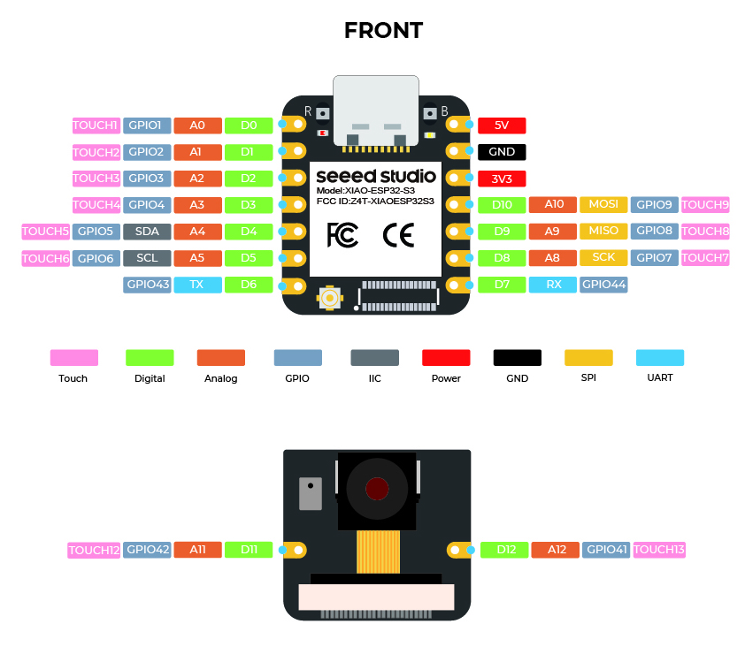

# Nerd Neck on ESP32-S3

This small device will detect bad posture, if the person wearing this device has it attached to the back.

## Idea

We read IMU data in a cycle. Every 200 milliseconds we sample the median (of the current x measurement values we have)
with a moving median filter, or RANSAC filter, to filter out outliers.

If the angle of the IMU passes a certain threshold and stays there for a certain amount of y seconds,
the device will start beeping, notifying the person to rectify its position.

## Problems:

Gyroscope does drift, when integrated over time, so we need to correct those values with sensor fusion algorithms,
with other sensor values. Both IMUs we can use, also come with an accelerometer.
So we combine smooth short-them gyroscope data with long-term stability of accelerometer data.

Possible Filters:

- **Complementary filter** (simpler but effective for many use cases).
- **Madgwick filter** (a fast, quaternion-based algorithm for IMUs).
- **Mahony filter** (similar to Madgwick with some differences in accuracy and computation).
- **Kalman filter** (complex but precise, especially for combining multiple sensors).

**Note**: As we are only interested in the tilt of the IMU (diff angle to the vertical z-axis), we can neglect
the yaw angle (which would be corrected be the magnetometer, which we do not have).

So we can use either Madgwick or Mahony with only given accelerometer and gyro values.

## IMU Sensors

We have several IMU Sensors
- [BMI160](https://www.dfrobot.com/product-1716.html)
- [MPU6050](https://learn.adafruit.com/mpu6050-6-dof-accelerometer-and-gyro/arduino)

Both can be addressed via a I2C-Bus.

## Software for the MPU6050

There is already a [MPU6050 crate](https://docs.rs/mpu6050/0.1.6/mpu6050/). It's usable with i2c.

## Software for the BMI160

There is already a [BMI160 create](https://docs.rs/bmi160/1.1.0/bmi160/). Also usable with i2c.

## I2C interface

This bus comes with a dataline (sda) and a line for the clock signal (scl).

You can connect several devices to the bus, like shown below.

Below is a code snippet to connect the esp32 with i2c to an external device

Note from [espressif](https://docs.espressif.com/projects/esp-idf/en/v5.3.2/esp32s3/api-reference/peripherals/i2c.html):

> The frequency of SCL is influenced by both the pull-up resistor and the wire capacitance. Therefore, users are strongly recommended to choose appropriate pull-up resistors to make the frequency accurate. The recommended value for pull-up resistors usually ranges from 1K Ohms to 10K Ohms.
Keep in mind that the higher the frequency, the smaller the pull-up resistor should be (but not less than 1 KOhms). Indeed, large resistors will decline the current, which will increase the clock switching time and reduce the frequency. We usually recommend a range of 2 KOhms to 5 KOhms, but users may also need to make some adjustments depending on their current draw requirements.

**TL;DR**: Use 2-10kOhm resistors as pull up resistors.
The higher the frequency, the lower the ohmage should be.

We use 4.7k Ohms as pull-up resistors.

## Pinouts of esp32s3 from Seeed

## Current Wiring

We have an i2c setup, where two 4.7k Ohm resistors are used as 
pull up resistors. If scl/sda are off, both signals are pulled up
up to the logical 3.3 volts (high). The IMU (on the right)
will pull the signal down if needed.

## Building and flashing

### Prerequisites

Install all the depenendencies:

- Install [Rust](https://www.rust-lang.org/tools/install)
- Install esp tooling
  - `cargo install espup espflash`
  - `espup install`

### Building/Flashing

Then go into the the `nerd-neck` directory and
`source ~/export-esp.h` (generated from `espup install`).

To build and flash it the firmware to the device,
just run `cargo run --release`.

