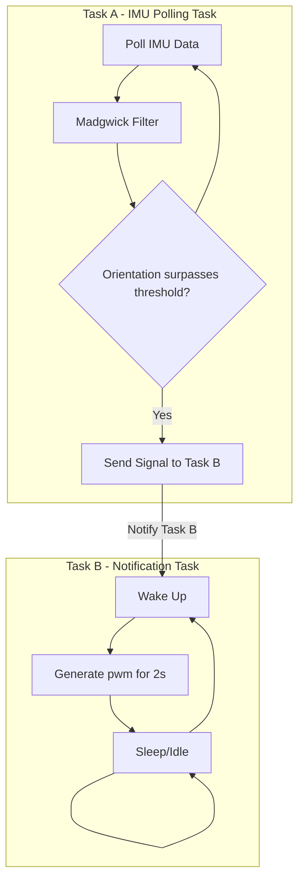
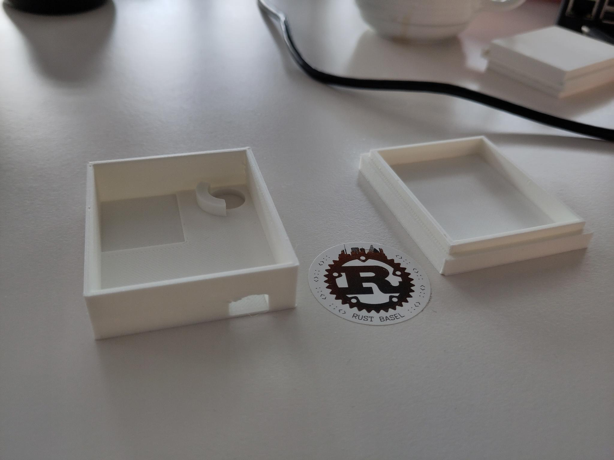
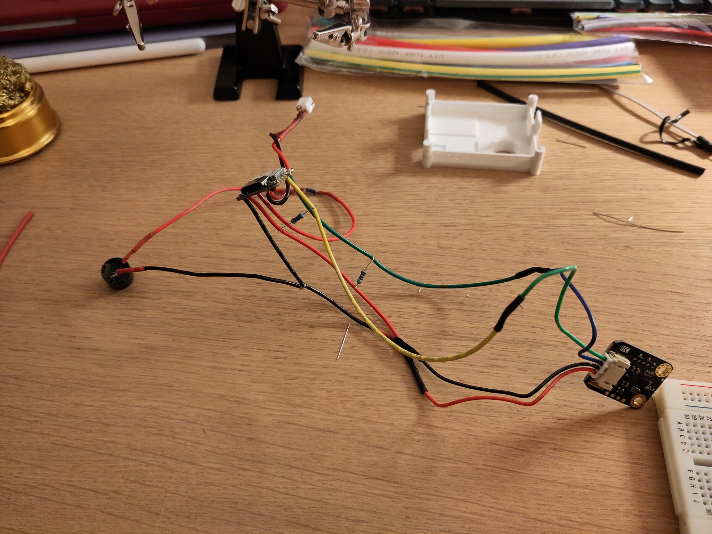

# Nerd Neck - Computer Architecture HS2024

Report for the nerd neck device. An embedded project for the lecture _Computer Architecture_ at the University Basel for
HS 2024.

Date: 19.01.2025

Student: Yasin Gündüz

# Abstract

The Nerd Neck project is a 3d printed wearable device designed to help people maintain a good posture, especially those
who
spend long hours sitting, like office workers or students. The device is attached to a persons back.

The device uses an ESP32-S3 microcontroller, a 6-DoF IMU sensor to detect the current orientation, a LiPo battery
for portability, and an active piezo buzzer that alerts the user when their posture needs correcting. By analyzing
IMU
data and applying a Madgwick filter for accuracy, it detects poor posture efficiently.

The device firmware is programmed in Rust, using tools like esp-hal, a hardware abstraction layer for the esp family.
Also,
embassy is used, an async runtime for embedded targets, making it pleasant to run asynchronous tasks. The firmware
can
be built and flashed directly from a computer with one simple
command due to the given tooling.

# Project and Code

The project is open-source with an [MIT](https://en.wikipedia.org/wiki/MIT_License) license. The code and the stl-files
for the 3d print can be fetched at https://github.com/yguenduez/nerd-neck-esp32.

# Motivation and Outline

In today's society bad posture can lead to severe back pain. Especially in office jobs, where people are sitting most of
the time. We want to reduce the time, people are sitting in a bad posture, which is known as doing a **"nerd-neck"**.

Therefore, we create a small wearable device, that is attached to the back of a person. That device should detect, if a
person has
a bad posture, e.g. during sitting. Like a seat belt in car, that is not closed, an annoying sound should remind the
wearer of the device of his bad posture.

The device is polling the current orientation from the intertial measurement unit (IMU) every 50 milliseconds.
As the IMU angular velocities are error-prone in general, a sensor fusion algorithm is used,
i.e. the Madgwick filter, to integrate the angular velocity over time and have an error correction to it.

If the orientation surpasses a configurable threshold, we activate an active buzzer, that is powered
directly with a 1kHz Pulse Modulo Width (PWM) signal, generating the annoying sound.

# Software

The firmware for the esp32s3 is written with Rust. [Espressif](https://www.espressif.com/), the creators of the esp32
family created a lot of tooling
around Rust
for their chips. With one line of a command, we can build and flash our firmware directly onto the esp32 from any host
system (in this case MacOS or Windows 11) via usb-c.

## Use of open-source libraries and frameworks

The [esp_hal](https://github.com/esp-rs/esp-hal), an esp hardware abstraction layer for Rust. With it you can
access the ESP GPIO pins, or create other interfaces like i2c in an easy and convenient way.

Also, [embassy](https://embassy.dev/) is used, an asynchronous runtime for embedded systems, that makes it easy
to create asynchronous tasks and to communicate between those.

For the inertial measurement unit (IMU), we use a library called [bmi160-rs](https://github.com/eldruin/bmi160-rs) and
created a small adapter around the library's API to our needs.
It correctly addresses all registers of the IMU. Futhermore, it accepts
an I2c interface and even handles the I2c communication for us. We only have to create an I2c
interface with the esp-hal (see above), by selecting two General Purpose Input/Output (GPIO) pins
for the data and the clock signal.

As gyroscope data tends to drift over time, when you integrate the angular velocities a sensor fusion
filter is used. We use the [Madgwick](https://ahrs.readthedocs.io/en/latest/filters/madgwick.html) filter,
which is designed to work well on an embedded system. The filter is especially designed for IMUs like the one
we use here. As a library, we use [ahrs-rs](https://github.com/jmagnuson/ahrs-rs), which is a rust implementation
for the Madgwick filter. An adapter around the library API is created to fit our needs.

Furthermore, [nalgebra](https://github.com/dimforge/nalgebra) is used to work with quaternions, calculating angles.

## Architecture

We have two asynchronous running tasks, namely the IMU polling task and the notification task.

The IMU polling tasks polls every 50 milliseconds in an endless loop the angular velocities,
as well as the acceleration data from the IMU.
Directly after, both vectors are given to the Madgwick Filter adapter, to stabilise the errors of the IMU
data.
From our Filter we receive a quaternion, which describes the current orientation of our device.
In the end of the loop cycle of the IMU polling task, we check if the device's orientation to the z-Axis (direction of
gravity) surpasses a threshold.
Namely, if the angle between the IMU's Z-axis and the gravity's direction
is greater than e.g. 45 Degrees, we send a signal to the notification task, to wake it up.

The notification task is sleeping and is awakened by the polling task. When the notification task is awakened
we generate a PWM signal of 1kHZ for 2 seconds and put the notification task back to sleep to save power.

When the PWM signal is on, an active buzzer generates sound.
We manually generate the PWM signal
by setting a General Purpose Input/Output (GPIO) pin to high, wait 500 microseconds and set the GPIO pin
to low again. While the Buzzer is active (pwm is on) any further signals from the first task are ignored.

## Parametrisation of the Madgwick Filter

The Madgwick filter ([paper](https://x-io.co.uk/downloads/madgwick_internal_report.pdf)) is a sensor fusion algorithm
by [Sebastian Madgwick](https://ahrs.readthedocs.io/en/latest/filters/madgwick.html),
that is suited well for embedded devices due to its efficiency.

It integrates the angular velocities, by integration of the quaternion derivatives over time.
As integration of angular velocities from an IMU is prone to drift, the madgwick filter uses
the earth's gravity field as a reference direction to compensate for that IMU
drift
([source here](https://ahrs.readthedocs.io/en/latest/filters/madgwick.html#orientation-as-solution-of-gradient-descent)).

Therefore, the Madgwick filter has one parameter you need to adjust.
It is called the filter gain beta, and there exist
some recommendations on which value to choose from.

A value of 0.1 is used (This is the recommended default value for a general purpose application).

When picking the right value for beta, there is a trade-off between the stability
of the resulting orientation and its response. For example for drones, which
have to react fast, the Madgwick Filter is optimised for high responsiveness.
On almost static, or human motion tracking the filter is optimised for stable output.

# Hardware

## Bill of Materials

The device consists of:

- a small microcontroller unit (MCU), an esp32s3 from xiao seeed, which has a small form
  factor. [Link](https://www.bastelgarage.ch/seeed-studio-xiao-esp32-s3-1-2809?search=esp32s3%20xiao%20seeed).
- an inertial measurement unit (IMU), that can measure acceleration and the angular velocity with a
  gyroscope. [Link](https://www.bastelgarage.ch/gravity-i2c-bmi160-6-axis-motion-sensor-with-gyroscope?search=bmi160)
- a small lithium polymer (LiPo) battery, to power the wearable
  device. [Link](https://www.bastelgarage.ch/solar-lipo-1-105/lipo-battery-1500mah-jst-2-0-lithium-ion-polymer).
- a small beeper/buzzer to notify the person about a bad
  posture. [Link](https://www.bastelgarage.ch/piezo-buzzer-summer-active?search=active%20buzzer)
- 2x 4.7k Ohm Resistors for the i2c connection.
- 1x 100 Ohm Resistor for the GPIO pin 7 for overdrawing protection
- Wires to connect the components by soldering
- JST-PH crimp plugs and sockets (To not directly solder the battery to the
  MCU), [link](https://www.bastelgarage.ch/jst-ph-crimp-stecker-und-buchsen-2mm-set-40-stuck)

which are all contained in a 3d printed housing.

## Wiring

This fritzing image below shows the wiring. The parts in the image are different from the ones, that are used.
The wiring, however, is exactly the same.

The i2c is connected to the GPIO pin 5 (dataline) and GPIO pin 6 (clockline) of the esp32-s3.

Furthermore, two 4.7k Ohm pull up resistors are used. Otherwise, the i2c connection does not work, as the sensor can
only
pull the signal down, but not up again.

The active buzzer is directly connected to GPIO pin 7 of the esp32 with a 100 Ohm resistor
to protect the GPIO from overdrawing it.

You can find the pins below in the pinouts section.

### Pinouts of the Esp32s3

These are the pinouts of the esp32-s3 from xiao seeed.

## 3D Printed Casing

The 3d printed underwent 6 iterations, until we reached the final version, that consists of a bottom part and a top
part, that are connected via a press fit connection. The bottom part houses the battery, whereas the top part houses the
MCU, the IMU Sensor as well as the buzzer.

The housing has components to fit in:

- a LiPo battery with dimensions 52x42x5mm
- the BMI160 IMU with dimensions 23x27mm
- the esp32s3 from seeed with dimensions ~20x25mm. Also having access to its usb-c port.
- the piezo buzzer with its dimensions 6mm radius and about 10mm of height
- spare volume space for the wiring between the components

The parts for the final print can be fetched [here](https://github.com/yguenduez/nerd-neck-esp32/tree/main/3dprint).
The slicing software has been [Snapmaker Luban](https://www.snapmaker.com/en-US/snapmaker-luban) from the
same company, that is building the snapmaker 3d printer. For printing we use the F350 Snapmaker Luban 3d printer.

For designing the parts [FreeCad](https://www.freecad.org/), and open-source CAD software was used.

Below you can see the finished 3d printed casing in its final version.

# Building and Flashing

In order to build and flash the software you need to have the Rust toolchain installed.

## Prerequisites

Install all the depenendencies:

- Install [Rust](https://www.rust-lang.org/tools/install)
- Install esp tooling
    - `cargo install espup espflash`
    - `espup install`

## Building/Flashing

Then `cd` into the `nerd-neck` directory and
`source ~/export-esp.h` (generated from `espup install`).

To build and flash it the firmware to the device,
just run `cargo run --release`.

# Closing

Creating an embedded device was quite a challenge, but quite a rewarding experience, doing things like soldering
the first time.

## Challenges

There have been several challenges when doing this project.

### IMU Drift

It is quite a known problem that IMU data (especially gyroscope data) is prone to drift, when integrated over time.
Finding a solutions to it is trivial, as several different sensor fusion algorithms exist
to this problem.
So this issue was a more spoilt for choice.

Several known sensor fusion algorithms have been looked at:

- Complementary filter (simpler but effective for many use cases).
- Madgwick filter (a fast, quaternion-based algorithm for IMUs).
- Mahony filter (similar to Madgwick with some differences in accuracy and computation).
- Kalman filter (complex but precise, especially for combining multiple sensors).

In the end, it was more a question of whether there is an existing, well working library for the filter
problem,
which was found in the [ahrs-rs](https://github.com/jmagnuson/ahrs-rs) library. It implements the Madgwick filter.

If there was more time, the different filters could have been compared to one another.

### 3d Printing

Printing such a small device, with wall thickness at around 1mm is prone to break,
when already a small force is applied.

As a casing was built, it always consisted of a bottom part and a top part.
In the bottom part, the battery is housed.
Whereas in top part, the IMU, MCU and
the buzzer have their place.

Issues occurred when trying to connect the bottom and the top part of the casing.
In the first designs (You can look at the [projects readme](https://github.com/yguenduez/nerd-neck-esp32)),
it was tried to snap both parts together. Those snappings, however, always broke.

The designs after tried a slide approach. You could slide the bottom part into the top part.
Here the issue has been that the space within the casing got too small. Whereas the housing itself
was quite big.

In the final designs, everything was simplified. Instead of snapping and sliding,
an overfit between the bottom and the top part is used, a so called _press-fit_. Meaning they do not fit perfectly into
one other.
You have to press both parts into each other. The friction between those parts are keeping those
parts together. The design is much simpler than the previous ones.

### API Breaking Changes

As Rust is quite new (atleast in the embedded world) library APIs tend to break a lot. This means tutorials and howtos,
where you get your information from, are already outdated, when you read themo.

Even the use of ChatGPT was of not of much use, as its training data has been from older versions of the documentation
of
libraries. It only helped in finding a library, but not with its usage.
Only the libraries' documentations themselves were really helpful,
when developing Rust on the embedded side.

Usually a crate (A rust library or executable, anything that creates a binary) comes with documentation. But its up
to the maintainer of the library to keep the documentation up to date.

### Soldering

With no prior experience in soldering, it was quite hard to solder everything together. Below you can see
the soldered device (before it went into the housing).

Creating this project was a pleasant first embedded experience, creating a device, that can help

### Improvements

There are several ideas that could be followed:

- Using an MCU with an integrated IMU: For example
  the [Seeed xiao nRF sense](https://www.seeedstudio.com/Seeed-XIAO-BLE-Sense-nRF52840-p-5253.html) comes with an
  integrated IMU. With this the I2c connection could be made obsolete.
- Smaller LiPo Battery: The battery is quite oversized for such a small project. A smaller battery could be used, making
  the device
  even smaller
- All the MCUs support Bluetooth. Or even Bluetooth Low Energy. One could connect the device via bluetooth to a
  smartphone.
- Cable Management is quite complex for such a small project: This could be simplified. One could even design his own
  PCB.
- There is no information about the current battery charge. One could implement a small battery charge reader with an
  analog input pin