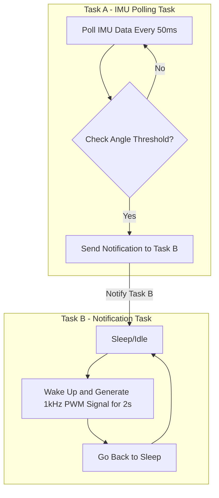

# Nerd Neck - Computer Architecture HS2024

Report for the nerd neck device. An embedded project for the lecture _Computer Architecture_ at the University Basel for
HS 2024.

## Students involved

Yasin Gündüz  

# Abstract

The Nerd Neck project is a 3d printed wearable device designed to help people maintain a good posture, especially those
who
spend long hours sitting, like office workers or students.

The device uses an ESP32-S3 microcontroller, a 6-DoF IMU sensor to detect the current orientation, a LiPo battery
for portability, and an active piezo buzzer that alerts the user when their posture needs correcting. By analyzing
IMU
data and applying a Madgwick filter for accuracy, it detects poor posture efficiently.

The device firmware is programmed in Rust, using tools like esp-hal, a hardware abstraction layer for the esp family. Also,
embassy is used, an async runtime for embedded targets, making it pleasant to run asynchronous tasks. The firmware
can
be built and flashed directly from a computer with one simple
command due to the given tooling.

# Project and Code

The project is open-source with an [MIT](https://en.wikipedia.org/wiki/MIT_License) license. The code and the stl-files
for the 3d print can be seen at https://github.com/yguenduez/nerd-neck-esp32.

# Motivation and Outline

In today's society bad posture can lead to severe back pain. Especially in office jobs, where people are sitting most of
the time. We want to reduce the time, people are sitting in a bad posture, which is known as doing a **"nerd-neck"**.

Therefore, we create a small wearable device, that is attached to the back of a person. That device should detect, if a
person has
a bad posture, e.g. during sitting. There we poll IMU data every 50 milliseconds and applying a sensor fusion algorithm
to overcome the IMU-Drift.

# Functionality

The device is polling the current orientation from the intertial measurement unit (IMU) every 50 milliseconds, resulting
in frequency of 20 hertz. As the imu angular velocities are error-prone in general, we use a sensor fusion algorithm,
i.e. the Madgwick filter, to stabilise the orientation we get.

If the orientation surpasses a configurable threshold, we activate an active buzzer, that is powered
 directly with a 1kHz Pulse Modulo Width (PWM) signal.

# Software

We decided to program the esp32s3 with Rust. [Espressif](https://www.espressif.com/), the creators of the esp32 family created a lot of tooling
around Rust
for their chips. With one line of a command, we can build and flash our firmware directly onto the esp32 from any host
system (in this case MacOS and Windows 11) via usb-c.

## Use of open-source libraries and frameworks

We use the [esp_hal](https://github.com/esp-rs/esp-hal), an esp hardware abstraction layer for Rust. With it you can
access the ESP GPIO pins, or create other interfaces like i2c in an easy and convenient way. 

Also, we used [embassy](https://embassy.dev/), an asynchronous runtime for embedded systems, that makes it easy
to create asynchronous tasks and to communicate between those.

For the inertial measurement unit (IMU), we use a library called [bmi160-rs](https://github.com/eldruin/bmi160-rs) and
created a small adapter around the library's API to our needs.
It correctly addresses all registers of the IMU. Futhermore, it accepts
an I2c interface and even handles the I2c communication for us. We only have to create an I2c
interface with the esp-hal (see above), by selecting two General Purpose Input/Output (GPIO) pins
for the data and the clock signal.

As gyroscope data tends to drift over time, when you integrate the angular velocities a sensor fusion
filter is used. We use the [Madgwick](https://ahrs.readthedocs.io/en/latest/filters/madgwick.html) filter,
which is designed to work well on an embedded system. The filter is especially designed for IMUs like the one
we use here. As a library, we use [ahrs-rs](https://github.com/jmagnuson/ahrs-rs), which is a rust implementation
for the Madgwick filter. An adapter around the library API is created to fit our needs.

## Architecture

We have two asynchronous running tasks, namely the IMU polling task and the notification task. 

The IMU polling tasks polls every 50 milliseconds in an endless loop the angular velocities,
as well as the acceleration data from the IMU.
Directly after, both vectors are given to the Madgwick Filter adapter, to stabilise the errors of the IMU
data.
From our Filter we receive a quaternion, which describes the current orientation of our device. 
In the end of the loop cycle of the IMU polling task, we check if the device's orientation to the z-Axis (direction of
gravity) surpasses a threshold.
Namely, if the angle between the IMU's Z-axis and the gravity's direction
is greater than e.g. 45 Degrees, we send a signal to the notification task, to wake it up.

The notification task is sleeping and is awakened by the polling task. When the notification task is awakened
we generate a PWM signal of 1kHZ for 2 seconds and put the notification task back to sleep to save power.

When the PWM signal is on, an active buzzer generates sound.
We manually generate the PWM signal
by setting a General Purpose Input/Output (GPIO) pin to high, wait 500 microseconds and set the GPIO pin
to low again.

# Hardware

## Bill of Materials

The device consists of:

- a small microcontroller unit (MCU), an esp32s3 from xiao seeed, which has a small form
  factor. [Link](https://www.bastelgarage.ch/seeed-studio-xiao-esp32-s3-1-2809?search=esp32s3%20xiao%20seeed).
- a inertial measurement unit (IMU), that can measure acceleration and the rotation speed with a
  gyroscope. [Link](https://www.bastelgarage.ch/gravity-i2c-bmi160-6-axis-motion-sensor-with-gyroscope?search=bmi160)
- a small lithium polymer (LiPo) battery, to power the wearable
  device. [Link](https://www.bastelgarage.ch/solar-lipo-1-105/lipo-battery-1500mah-jst-2-0-lithium-ion-polymer).
- a small beeper/buzzer to notify the person about a bad
  posture. [Link](https://www.bastelgarage.ch/piezo-buzzer-summer-active?search=active%20buzzer)
- 2x 4.7k Ohm Resistors for the i2c connection.
- 1x 100 Ohm Resistor for the GPIO pin 7 for overdrawing protection
- Wires to connect the components by soldering
- JST-PH crimp plugs and sockets (To not directly solder the battery to the
  MCU), [link](https://www.bastelgarage.ch/jst-ph-crimp-stecker-und-buchsen-2mm-set-40-stuck)

## Wiring

This fritzing image below shows the wiring. The parts in the image are different from the ones, that are used.
The wiring, however, is exactly the same.

The i2c is connected to the  GPIO pin 5 (dataline) and GPIO pin 6 (clockline) of the esp32-s3.

Furthermore, we use two 4.7k Ohm pull up resistors. Otherwise, the i2c connection does not work, as the sensor can only
pull the signal down (0Volts), but not up again.

The active buzzer is directly connected to the GPIO pin 7 of the esp32 with a 100 Ohms resistor
to protect the GPIO from overdrawing it.

You can find the pins below in the pinouts section.

### Pinouts of the Esp32s3

These are the pinouts of the esp32-s3 from xiao seeed.

# Building and Flashing

In order to build and flash the software you need to have the Rust toolchain installed.

## Prerequisites

Install all the depenendencies:

- Install [Rust](https://www.rust-lang.org/tools/install)
- Install esp tooling
    - `cargo install espup espflash`
    - `espup install`

## Building/Flashing

Then `cd` into the `nerd-neck` directory and
`source ~/export-esp.h` (generated from `espup install`).

To build and flash it the firmware to the device,
just run `cargo run --release`.

# 3D Printed Casing

The 3d printed underwent 5 iterations, until we reached the final version, that consists of a bottom part and a top
part, that are connected via a press fit connection. The bottom part houses the battery, whereas the top part houses the
MCU, the IMU Sensor as well as the buzzer.

Our housing has these requirements:

- a LiPo battery (3.7 Volts),
  e.g. [this one](https://www.bastelgarage.ch/lipo-akku-1500mah-jst-2-0-lithium-ion-polymer?search=lipo) (52x42x5mm),
- the BMI160 IMU from DFRobots with dimensions 23x27mm as well as the
- the esp32s3 from seeed with dimensions ~20x25mm. Also having access to its usb-c port.
- the piezo buzzer with its dimensions, e.g. [this one](https://www.bastelgarage.ch/piezo-buzzer-summer-aktiv) (12mm)
- spare volume space for the wiring between the components

# Challenges

The main challenge of this project has been the 3d printing of the casing, as well as overcoming the IMU drift.

Also, as Rust is a relatively new language (compared to C), libraries and the hardware abstraction layer tend to have
many breaking changes in their APIs.

## IMU Drift

TODO: Integration of
Choosing of the Filter - Finding the library to it

## 3d Printing

TODO: As small and fiddly. You cannot print small, breaking things etc.
TODO: In total 6 Iterations, until 
TODO: In the end: simple is the best apporach: fitpress

## API Breaking Changes

TODO: New versions, new API - need to study the docs.

## Soldering

TODO: Soldering parallel parts, like the pull up resistors